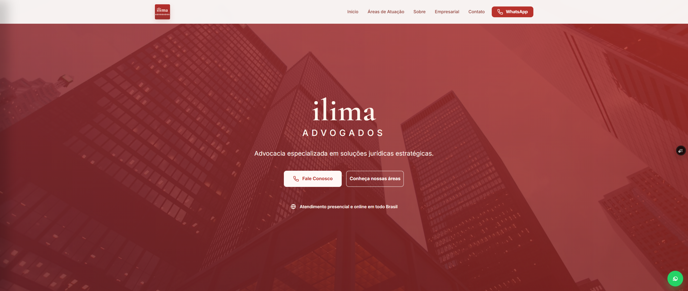
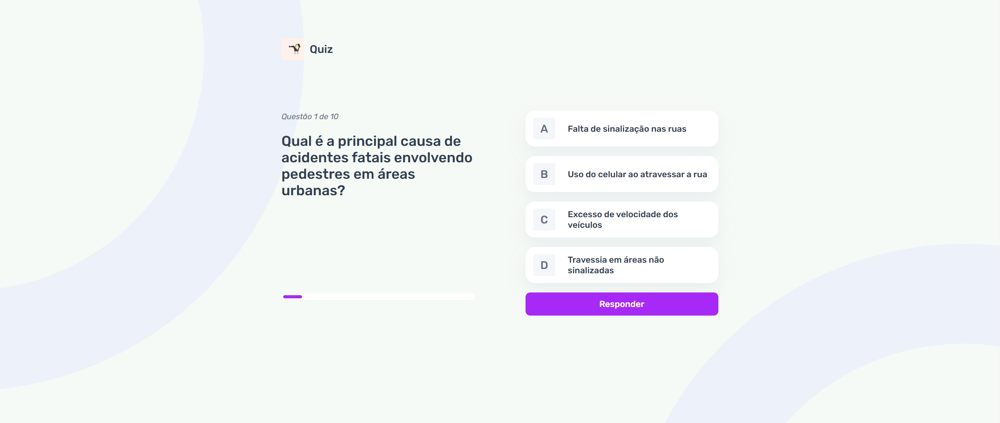
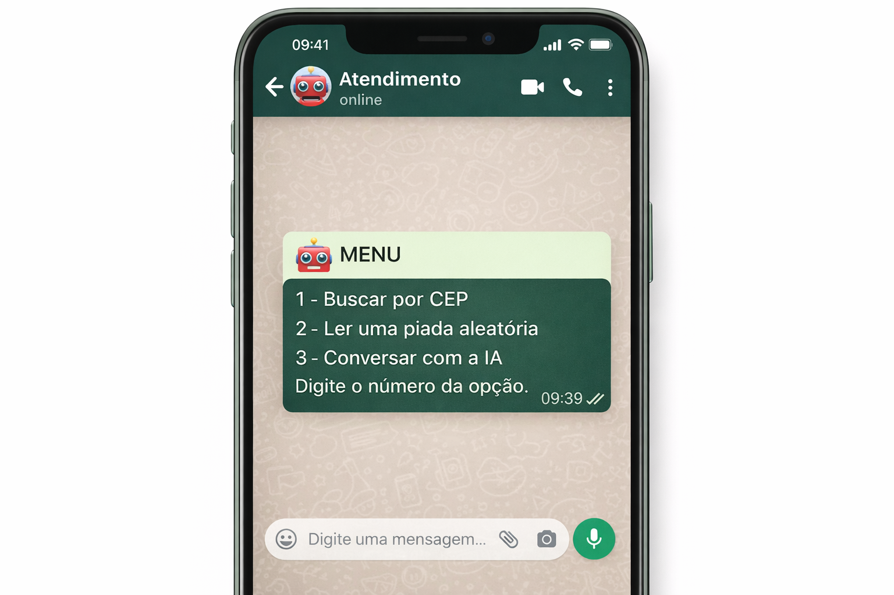

# 👨‍💻 Eduardo Oliveira

  

---

## 🚀 About Me

I'm a Front-End developer focused on creating professional, responsive websites and solutions that help businesses generate more clients.

I work with modern interfaces, API integrations, and AI-powered automation, always striving to combine design, performance, and real results.

---

## 🛠️ Technologies

  
  
  
  
  

---

## 📌 Featured projects

### 🔹 Legal website

Professional landing page focused on credibility and conversion.

🔗 [View project](https://ilima-advogados-git-1a5623-eduardo-oliveiras-projects-9e8e2497.vercel.app)

---

### 🔹Interactive Quiz

Interactive front-end quiz, using HTML, CSS, and JavaScript, aimed at raising pedestrian awareness about safe practices when walking on the streets.

🔗 [View project](https://other-quiz.vercel.app)

---

### 🔹 AI-powered chatbot for customer service.

Intelligent automation with API integration and AI-powered responses.

🔗 [View code](https://github.com/Eduuh1227/bot-whatsappweb/tree/bot-webwhatsapp)

---

## 📬 Contact

  
  
  

---

⭐ Constantly evolving, creating solutions that generate real impact.
